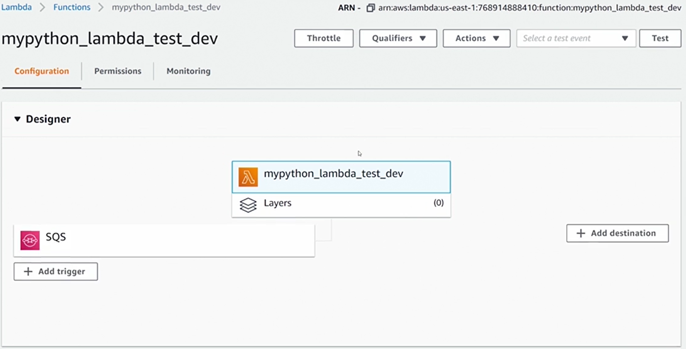

# dev-env-aws-terraform
Creating a Dev Environment in AWS with Terraform - Setting AWS Provider, Lambda Function, SQS Queues, Lambda Event Triggers, and Terraform Workspaces

# Infrastructure Overview:
The repository contains the setup of an AWS Simple Queue Service (SQS) as the main queue, integrated with a Python-based AWS Lambda function. The Lambda function processes messages from the main queue, emphasizing data integrity through a failsafe mechanism that redirects unprocessed messages to a dead letter queue for review.

- Diagram
  
